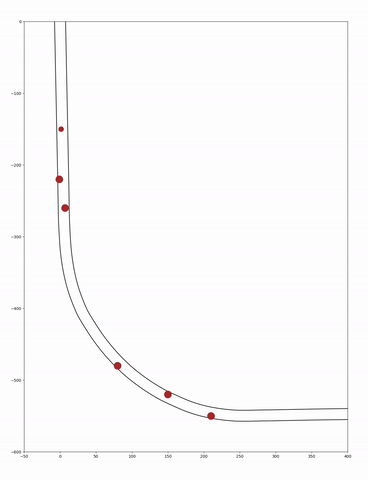
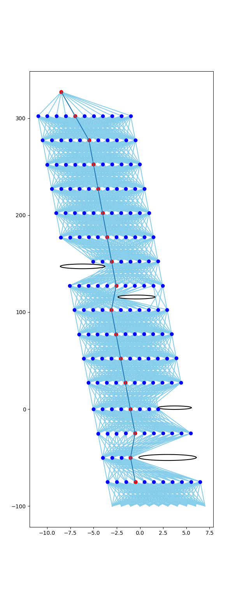

# IndyCar Obstacle Avoidance

Development work for IndyCar Autonomous Challenge
- Track lattice generation & cost map
- Path Planning & Obstacle Avoidance
- Trajectory Generation

**Methods motivated by TUM Multilayer Graph-Based Trajectory Planning: https://www.researchgate.net/publication/337625159_Multilayer_Graph-Based_Trajectory_Planning_for_Race_Vehicles_in_Dynamic_Scenarios 

